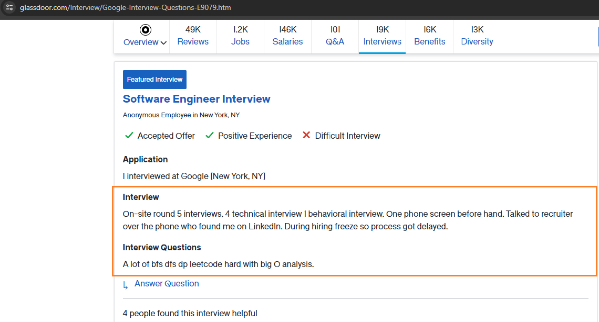

# README

### Disclaimer: 
This scraper is straightforward, performs just one hard-coded task, and probably won't work in the future.

### Function:
A simple scraper built using Puppeteer and Cheerio. Scrapes interview experiences and questions from the Interviews section under the Companies tab on the Glassdoor website.



## Installation and Configuration

Before running the scraper, ensure you have Node.js and npm installed on your system. After cloning the repository, navigate to the project directory and run the following command to install all the required dependencies:

```sh
npm install
```

Create a .env file in the project root with the following structure:

```sh
SCRAPING_URL=https://www.glassdoor.com/Interview/Google-Interview-Questions-E9079.htm
FILE_NAME=google_interviews
FILE_PATH=C:\glassdoor-scraper\scraped_data
```

## Usage

```sh
npm run start
```

This will initiate the scraping process based on the URL provided in your .env file. The results will be saved in the specified file and location.

